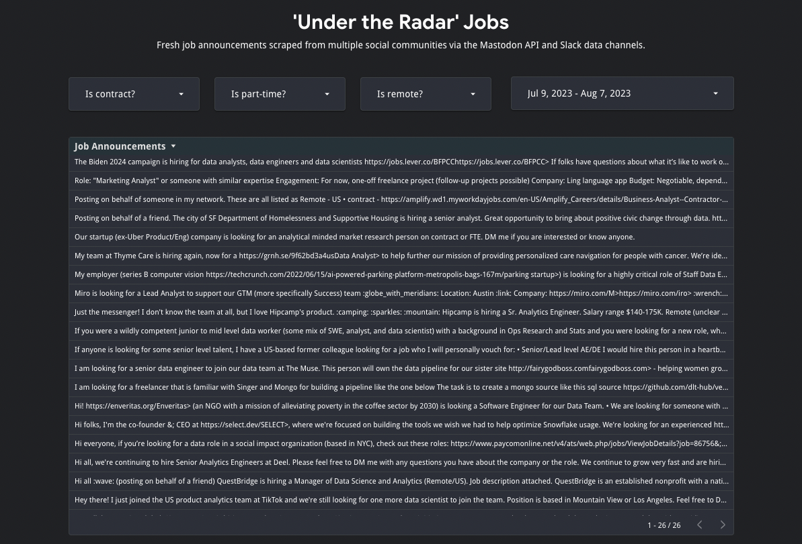

## Under the Radar Jobs

### Objective

My objective is to build a job search tool that taps into online social chatter. 

Specifically, this is a live **end-to-end data pipeline** which takes **unstructured sources** (like Slack, Mastodon and Twitter) as input and generates a list of **'under-the-radar' job announcements** as output.

Why?

 
Finding fulfilling work is a big deal, and I’ve always been interested in the chaotic way that it happens. 

It helps to be plugged into social communities for your chosen profession. But finding those communities takes time. And monitoring them all can get out of hand.

Can we tap into social communities to find jobs in a more systematic way? This project aims to find out.

 

### Workflow

- [x] **Ingestion** 
    - [x] Python script fetches posts from the Mastodon API and loads to a JSONL file.
    - [x] Python script fetches tweets from the Twitter API and loads to a JSONL file.[^1]
    - [x] Zapier automation fetches data from several Slack #job channels and loads to a Google Sheet
- [x] **Storage** - Python script generates a dataset + tables in BigQuery and loads ingested data there.
- [x] **Transformation** - dbt transforms source tables, preparing them for a filterable reporting layer.
- [x] **Reporting** - Looker Studio lists job announcements with filters for part-time, contract and remote positions.
- [ ] **Deployment** - Docker to containerize the pipeline.

[^1]: Recent results from the Twitter API show a trend towards automated job accounts and away from human users. So I am experimenting with a very narrow query that will reduce results from this source.
### Transformation

**Current state of the DAG**

Key transformations performed in [stg_jobs model](https://github.com/diaghilev/under-the-radar/blob/main/dbt/models/stg/stg_jobs.sql):
- [x] Slack data consists of _threaded messages_. Our desired output excludes thread replies.
- [x] Tweet data includes _duplicate tweets_. Our desired output removes duplicates.
- [x] Data from _multiple sources_ must be merged and presented in a single list.

Key transformations performed in [dim_jobs model](https://github.com/diaghilev/under-the-radar/blob/main/dbt/models/mart/dim_jobs.sql):
- [x] Identify which jobs are potentially part-time, contract or remote from unstructured text.
- [ ] Present unstructured, messy text in a more human-readable format.

Tests
- [x] Unique and Not Null tests for all primary keys
- [ ] Additional tests coming later

### Reporting

My primary objective is to generate a list of 'under the radar' job announcements.

But I also have a few questions, which will be answered over time in the [wkly_metrics](https://github.com/diaghilev/under-the-radar/blob/main/dbt/models/mart/wkly_metrics.sql) table:
- [x] In our sample, do we see an RTO trend in the form of decreasing remote jobs over time?
- [x] In our sample, is there an increase in contract jobs (relative to all jobs) during this economic downturn?
- [x] In our sample, is there an increase in parttime jobs (relative to all jobs) during this economic downturn?

